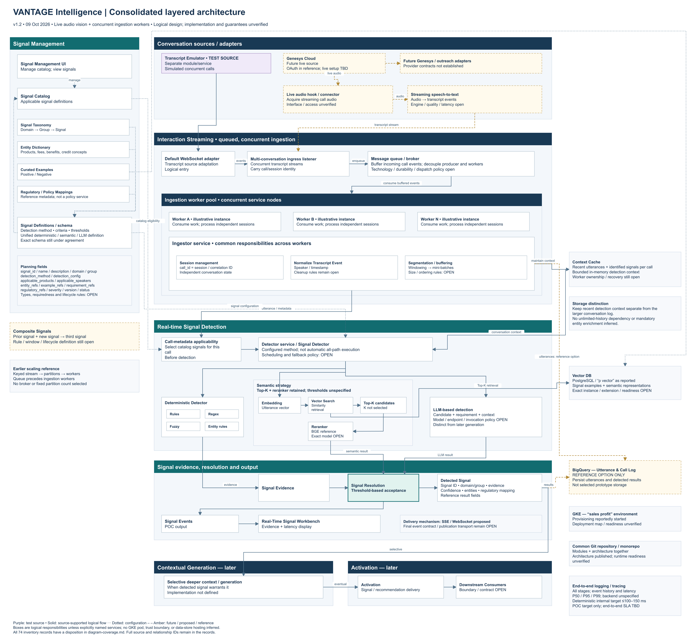

# Real-Time Intelligence — Architecture

Source-backed VANTAGE Intelligence architecture, currently **v1.2**. This repository contains the editable logical design, diagram renderer, component/relationship inventory, meeting extracts, decision history and review records. It is an architecture baseline, not an implemented or production-approved service stack.

## Start here

- [Architecture records](architecture/README.md)
- [Editable draw.io diagram](architecture/diagrams/VANTAGE_Intelligence_Layered_Architecture.drawio)
- [PNG preview](architecture/diagrams/VANTAGE_Intelligence_Layered_Architecture.preview.png)
- [Component inventory](architecture/component-inventory.md)
- [Relationships](architecture/integration-matrix.md)
- [Open questions](architecture/open-questions.md)
- [Current validation](architecture/validation-current.md)



## Regenerate the editable diagram and SVG

From the repository root, with Python 3:

```sh
python3 architecture/tools/render_architecture.py
```

The renderer uses Python's standard library and writes native editable draw.io XML, an SVG preview and layout metadata. It validates its source references, geometry and text fit. The committed PNG preview is generated separately from the SVG; regenerate/export that preview after changing the diagram. Open the `.drawio` file in diagrams.net to edit or export it visually.

## Source material and history

**Original input JPEG/JPG images are intentionally excluded.** The original image folders are not included, and `.gitignore` blocks JPEG/JPG files. Source IDs and filenames remain as external evidence locators in the records; they do not imply those source files are present in the repository. Generated PNG/SVG diagram previews are included.

Meeting extracts are architecture-relevant summaries, not full recordings. Earlier model/diagram versions are retained for traceability. Historical statements and reviews should be read together with the current model and subsequent decisions. The principal-architect review describes v1.0; v1.2 applies the approved presentation changes and shared threshold-based resolution.
